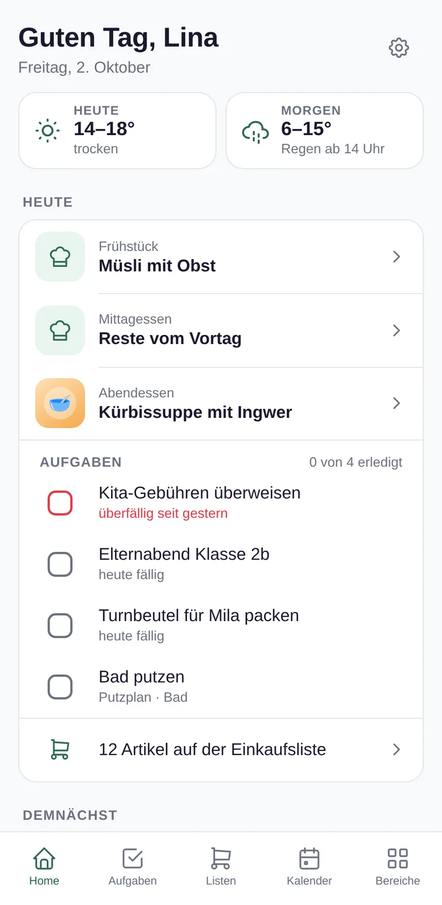
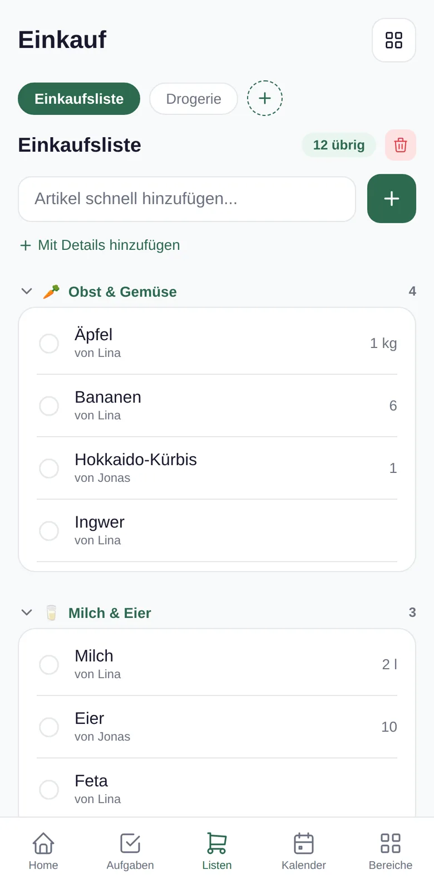
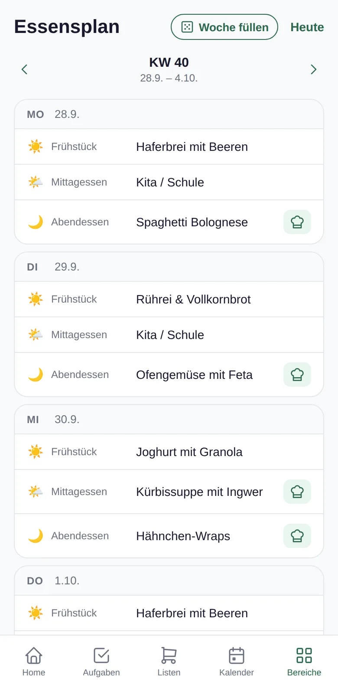

  

<h3 align="center">Die Familien-App, damit nicht mehr eine Person an alles denken muss.</h3>

  <a href="https://github.com/LinaLarsson42/nestio-releases/releases/latest/download/Nestio.apk"><b>⬇ Nestio für Android laden</b></a>
  &nbsp;·&nbsp; kostenlos &nbsp;·&nbsp; Updates kommen über die App

---

## Warum Nestio?

Einkaufszettel am Kühlschrank, Termine im Familienchat, Rezepte als Screenshots, Verträge im Ordner und der Rest in einem Kopf. Nestio bündelt das an einem Ort, den alle im Haushalt sehen: Aufgaben mit Zuständigkeit, eine gemeinsame Einkaufsliste, Essensplan und Rezepte, Stundenplan und Kinderroutine, Verträge mit Kündigungsfristen.

  
  &nbsp;
  

## Installation

1. [**Nestio.apk**](https://github.com/LinaLarsson42/nestio-releases/releases/latest/download/Nestio.apk) auf dem Android-Handy herunterladen und öffnen.
2. Fragt Android, ob der Browser Apps installieren darf: **Einstellungen** → **Aus dieser Quelle zulassen** einschalten, zurück, **Installieren**.
3. Nestio öffnen, Konto anlegen und einen Haushalt gründen oder mit dem Einladungscode beitreten.

**Updates:** Gibt es eine neue Version, zeigt die Startseite „Neue Version“ mit einem Knopf zum Laden. Deine Daten bleiben dabei erhalten. Alle Versionen stehen unter [Releases](https://github.com/LinaLarsson42/nestio-releases/releases).

## Deine Daten

Die Daten deines Haushalts liegen in einer Datenbank (Supabase), damit alle Mitglieder denselben Stand sehen. Sichtbar sind sie nur für Mitglieder deines Haushalts.

---

Dieses Repository enthält nur die Installationsdateien. Der Quellcode liegt in einem privaten Repository.
